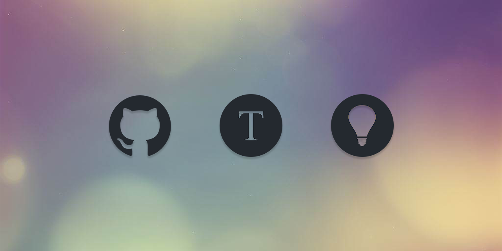

# GitHub Readme QotD



---

A GitHub Actions workflow to automate your repo Readme update with a dynamic Quote of the Day section.

<blockquote>&ldquo;Be the change that you wish to see in the world.&rdquo; &mdash; <footer>Mahatma Gandhi</footer></blockquote>

## Get Started

### Prepare Your Repository

1. Generate a new personal access token [here](https://github.com/settings/tokens/new) if you haven't already got one. Make sure the `repo` scope is selected.

   **IMPORTANT: Don't forget to save / copy your token as you won't be able to see it again after leaving the page.**

2. Go to `https://github.com/<your-username>/<your-repo>/settings/secrets/actions/new` to add a new Actions secret.

3. Paste your previously generated token (in step 1) to the `Secret` field and set the `Name` field as `REPO_TOKEN`

### Prepare Your README Markdown

- In your `README.md`, add the following code block to indicate the section to where the quote should be added:

  ```md
  <!--QOTD_STARTS_HERE-->

  <!--QOTD_ENDS_HERE-->
  ```

### Set Up GitHub Actions Workflow

1. Go to `https://github.com/<your-username>/<your-repo>/actions/new` and choose the option `set up a workflow yourself` to create a custom workflow.

2. You should be navigated to a new file editor with the path `<your-repo>/.github/workflows/main.yml`

3. Delete all the content in `main.yml` (if there is any), then paste the following:

   ```yml
   name: github-readme-qotd

   on:
     workflow_dispatch:
     schedule:
       - cron: '0 0 * * *'

   jobs:
     update-readme-qotd:
       runs-on: ubuntu-latest
       steps:
         - uses: larryh12/github-readme-qotd@main
           with:
             TOKEN: ${{ secrets.REPO_TOKEN_QOTD }}
   ```

4. The option `cron: '0 0 * * *'` set the workflow to run at 00:00 UTC everyday. If you want to change your workflow schedule, please refer to [Cron](https://en.wikipedia.org/wiki/Cron).

## Test Your Set Up _(Optional)_

Now that you have successfully set up your Actions workflow, you can wait for it to execute at 00:00 UTC to see if it's working correctly;

Or you can run it manually at any time to test your set up right away.

1. Go to the `Actions` tab of your repo at `https://github.com/<your-username>/<your-repo>/actions`.

2. You should now see the option `github-readme-qotd` under the `Actions` section. Click on it or manually go to `https://github.com/<your-username>/<your-repo>/actions/workflows/main.yml`.

3. You should see a notification saying `This workflow has a workflow_dispatch event trigger`. And you should now be able to click on the `Run workflow` button to run it manually.

4. You can check the run log of [my repo](https://github.com/larryh12/larryh12/actions/workflows/main.yml) to see examples of `Success` or `Failure` runs.

<br/>

---

<details>
<summary>Inspired from</summary>

[siddharth2016/quote-readme](https://github.com/siddharth2016/quote-readme) |
[cheehwatang/github-readme-daily-quotes](https://github.com/cheehwatang/github-readme-daily-quotes) |

</details>
